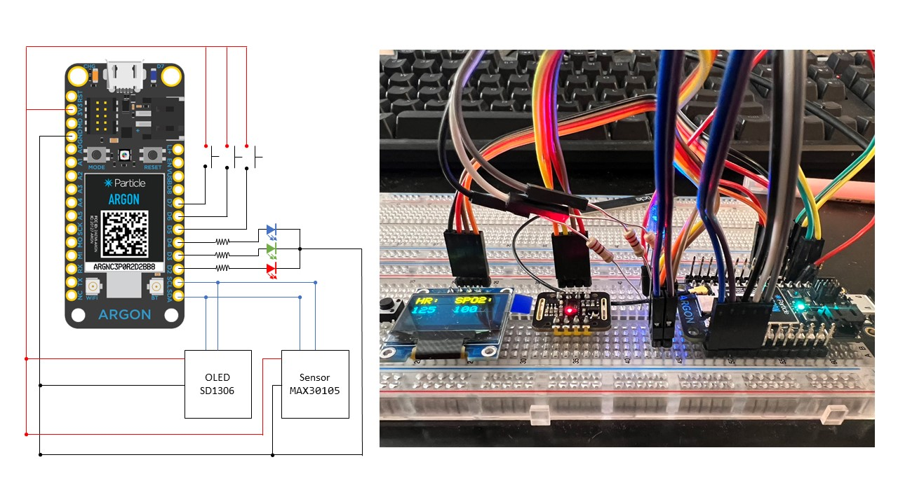

ECE513 Final Project (Particle MCU Side) - Team 4
======

This is a ECE513 final project code of particle MCU side. This project is a cloud heartrate monitor system for patient and physician. In this code, we make Particle Argon can read out sensor value from MAX30102. After readout the value, it will display value on OLED screen and publish it to Particle cloud platform.  
  
Because of particle project include project properties setting. Therefore, we strongly recommend reset a new project and move ```/src/Module``` and ```ECE513_Cloud.ino``` to your project.

Team members:

-Md Muhtasim Alam Chowdhury
-Chris Mastrangelo
-Muntasir Mamun


Firmware
---------

### Modules
|Module|Description|
| :- | :- |
|[Particle Cloud Function](https://docs.particle.io/reference/device-os/api/cloud-functions/particle-function/)|For sending data to Particle Cloud Environment for build a webhook|
|[SparkFun MAX3010x sensor library](https://github.com/sparkfun/SparkFun_MAX3010x_Sensor_Library)|For driving MAX30102 heartbeat sensor.|
|[Adafruit_SSD1306](https://github.com/adafruit/Adafruit_SSD1306)|For driving OLED display|
|[Ricmoo QRCode](https://github.com/ricmoo/QRCode)|Generated QRCode for display|

Hardware
---------

For hardware setting, please follow the BOM list and Pin Assignment.

### BOM List and Pin Assignment
|Device|Spec.|Number|Pin Assignment|
| :- | :- | :- | :- |
|Resistor|220 ohm|3|D2, D3, D4|
|Color LED|NTE30115|1|D2 – R, D3 – G, D4 – B|
|Display|SSD1306 128x64|1|SCL, SDA|
|Bottom|4 Pin|3|D7, D6, D5|
|Heartrate Sensor|MAX30102|1|SCL, SDA|

The circuit and the prototype is show in this figure:  

